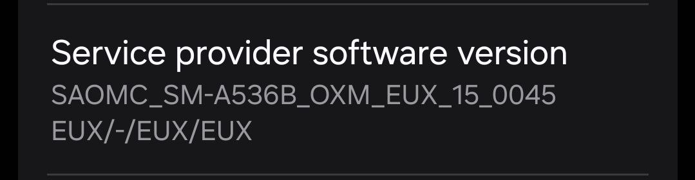

# Modem, bootloader and more
**for Galaxy A53 5G (a53x)**

To [download](https://github.com/UN1CA/proprietary_vendor_samsung_a53x/releases) the correct binaries for your firmware, check your device's model number and your current OMC sales code (ex. A536B**OXM**KGZC1):

### Credits
- [@jesec](https://github.com/jesec) and [@corsicanu](https://github.com/corsicanu) for the original GitHub Actions script.
